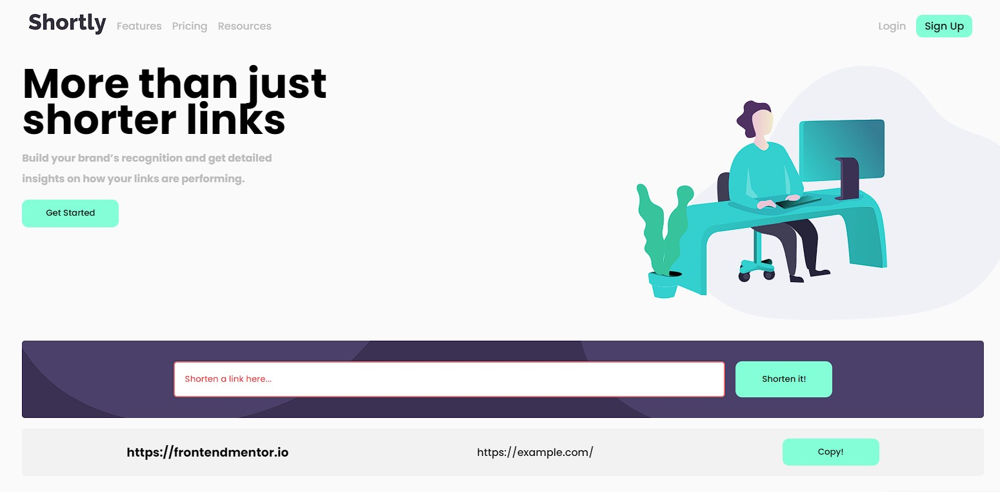

# Frontend Mentor - Shortly URL shortening API Challenge solution

This is a solution to the [Shortly URL shortening API Challenge challenge on Frontend Mentor](https://www.frontendmentor.io/challenges/url-shortening-api-landing-page-2ce3ob-G). Frontend Mentor challenges help you improve your coding skills by building realistic projects.

## Table of contents

- [Overview](#overview)
  - [The challenge](#the-challenge)
  - [Screenshot](#screenshot)
  - [Links](#links)
- [My process](#my-process)
  - [Built with](#built-with)
  - [What I learned](#what-i-learned)
  - [Continued development](#continued-development)
  - [Useful resources](#useful-resources)
- [Author](#author)
- [Acknowledgments](#acknowledgments)

## Overview

### The challenge

Users should be able to:

- View the optimal layout for the site depending on their device's screen size
- Shorten any valid URL
- See a list of their shortened links, even after refreshing the browser
- Copy the shortened link to their clipboard in a single click
- Receive an error message when the `form` is submitted if:
  - The `input` field is empty

### Screenshot



### Links

- Solution URL: [Add solution URL here](https://your-solution-url.com)
- Live Site URL: [Add live site URL here](https://your-live-site-url.com)

## My process

### Built with

- Semantic HTML5 markup
- Flexbox
- CSS Grid
- Javascript

### What I learned

I ran into numerous issues with using the following API's - Bitly and CleanURI

The documentation for both were not clear and I often ran into issues with CORS which I could not bypass. For Bitly's case, I was always blocked from fetching and it seemed like it was a common issue.

I have learned that I am able to start a NODE JS server to bypass the CORS issue but I still had issues with the server starting so I will have to come back to this issue in the future.

```js
const shorten = document.querySelector("#shorten");

shorten.addEventListener("click", () => {
  const url = document.querySelector("#url").value;
  postData(url);
});

async function postData(url) {
  console.log(url);
  try {
    const res = await fetch("https://cleanuri.com/api/v1/shorten", {
      method: "POST",
      headers: {
        "Content-Type": "application/x-www-form-urlencoded",
      },
      body: `url=${url}`,
    });

    const data = await res.json();
    console.log(data.result_url);
    displayData(data, url);
  } catch (err) {
    console.log(err);
  }
}
```

### Useful resources

- [Example resource 1](https://www.example.com) - This helped me for XYZ reason. I really liked this pattern and will use it going forward.
